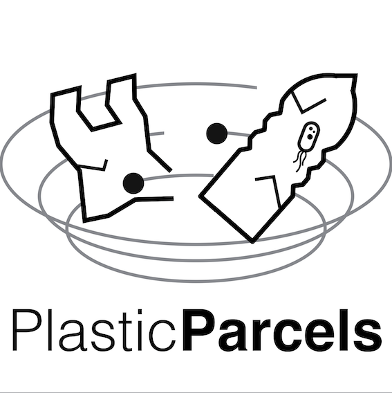

## plasticparcels
`plasticparcels` is a python package for simulating the transport and dispersion of plastics in the ocean.

The tool is based on the [`Parcels`](https://oceanparcels.org/) computational Lagrangian ocean analysis framework ([@Lange2017](http://dx.doi.org/10.5194/gmd-10-4175-2017) and [@Delandmeter2019](http://dx.doi.org/10.5194/gmd-12-3571-2019)), providing a modular and customisable collection of methods, notebooks, and tutorials for advecting virtual plastic particles with a wide range of physical properties.



### Installation

`plasticparcels` can be installed using `conda` from the [`conda-forge` channel](https://anaconda.org/conda-forge/plasticparcels) with the following command:

```bash
conda install conda-forge::plasticparcels
```

### Community contributions and support
#### Contributing code
We welcome contributions to `plasticparcels`, especially example workbooks and analyses for our [public examples page](https://plastic.oceanparcels.org/en/latest/examples.html). To contribute to the project, please submit a [pull request](https://github.com/OceanParcels/plasticparcels/pulls).

#### Requesting features and reporting issues/bugs
If you want to request a new feature, or if you find an issue or bug in the code, please open an issue in the [`plasticparcels` issue tracker](https://github.com/OceanParcels/plasticparcels/issues).

#### Seeking support?
If you would like support using `plasticparcels`, or are have any questions about your `plasticparcels` simulations, please start a discussion in the [`plasticparcels` discussion page](https://github.com/OceanParcels/plasticparcels/discussions).


### Further information
For more information and documentation, see the [plasticparcels documentation](https://plastic.oceanparcels.org/).

[](https://github.com/OceanParcels/plasticparcels/actions/workflows/unit_tests.yml)
[](https://anaconda.org/conda-forge/plasticparcels/)
[](https://anaconda.org/conda-forge/plasticparcels/)
[](https://doi.org/10.5281/zenodo.11388383)
