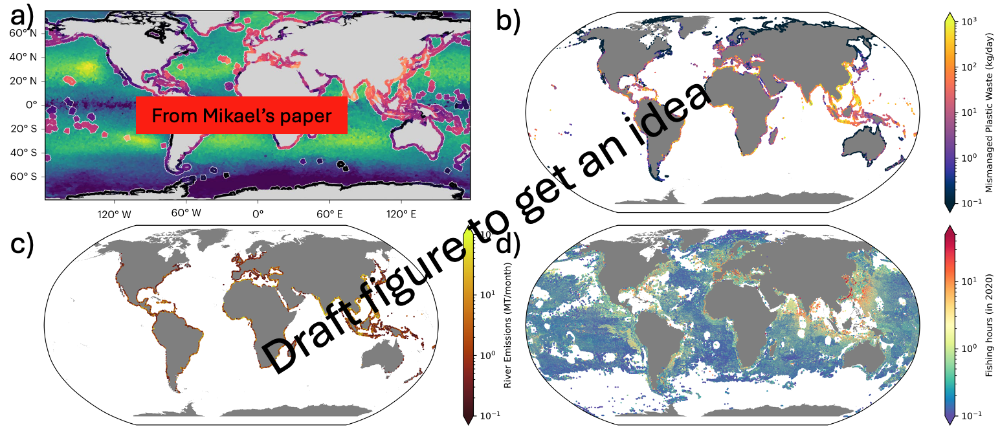

# Summary
`PlasticParcels` is a python package for simulating the transport and dispersion of plastics in the ocean. The tool is based on `v3.0.2` of the `Parcels` computational Lagrangian ocean analysis framework [@Lange2017, @Delandmeter2019], providing a modular and customizable collection of methods, notebooks, and tutorials for advecting virtual plastic particles with a wide range of physical properties. The tool applies a collection of physical processes to the virtual particles, such as Stokes drift, wind-induced drift, biofouling, and turbulent mixing, via custom particle behaviour programmed in the form of `Kernels`. In addition to the fine-scale physics parameterisations, `PlasticParcels` provides global particle initialisation maps that represent best estimates for plastic pollution emissions along coastlines [@Jambeck2015], from river sources [@Meijer2021], in the open-ocean from fishing-related activities [@Kroodsma2018], as well as a current best estimate of buoyant plastic concentrations globally [@Kaandorp2023]. We envisage PlasticParcels as a tool for rapid plastic dispersal simulations; as well as for rapid prototyping, development, and testing of new fine-scale physics parameterisations.

The current version supports nano- and microplastic behaviour, with support for macroplastics planned in the near-future. It has been designed for use with the Copernicus Marine Service platform [@CMEMS], providing new plastic modelling capabilities as part of the NECCTON project. `PlasticParcels` is easily adapted to run on local machines and high-performance computing (HPC) architecture with various hydrodynamic, biogeochemical, and other model inputs. A future goal is to embed `PlasticParcels` within a cloud platform to allow for even more rapid prototyping, development, and simulations.


# Statement of need
Marine plastic debris can be found almost everywhere in the ocean. A recent study estimates that there is approximately 3,200 kilotonnes of (initially) positively buoyant plastics in the global ocean in the year 2020 [@Kaandorp2023], where 59-62\% of these plastics are found at the ocean surface, 36-39\% within the deeper ocean, and 1.5-1.9\% along the coastline. They estimate that 500 kilotonnes of positively buoyant plastic enters the ocean each year, where 39-42\% originate from mismanaged waste along coastlines, 45-48\% originate from fishing-related activities (e.g. fishing lines, nets, traps, and crates), and 12-13\% from mismanaged waste entering the ocean via rivers. These estimates are for positively buoyant plastics, which make up only a fraction of the total production of virgin plastics each year **(Citation for percentage breakdown of pos. buoyant vs. neg. buoyant?)**.

Due to its durable, inert, and cheap-to-manufacture nature, plastic has become one of the most abundant man-made materials on Earth. Between 1950 and 2017 an estimated 8,300 million tonnes [@Geyer2017] of virgin plastic was produced, with the rate of production only set to increase. Its durability is of primary concern to the marine environment, where, without intervention, plastics will remain for millennia to come, and will likely degrade and fragment into smaller pieces that will disperse across ever larger distances. These plastics interact and interfere with marine wildlife, either entangling, or being inadvertently ingested, with documented cases affecting over 900 marine species so far [Kuhn2020]. To better understand and predict the effects of plastic pollution on the marine environment, it is of paramount importance that we understand where and how plastic enters our oceans, and the pathways of transport, dispersal patterns, and ultimate fate of these plastics.

Lagrangian ocean analysis, where virtual particles are tracked in hydrodynamic flow fields, is widely used to uncover and investigate the pathways and timescales of the dispersion of plastic particulates in the ocean [@Lebreton2012, @Hardesty2017, @JalonRojas2019, @Chassignet2021, @Kaandorp2023]. However, two important questions arise when performing such Lagrangian simulations. Firstly, what physical processes drive the transport and dispersal of a plastic particle? The properties of plastic particles (e.g., size, shape, and density) determine what the dominant physical processes are at play, and due to the chaotic nature of the ocean, plastics of different properties will have unique dispersal patterns and transport behaviours. Current state-of-the-art ocean models are either too coarse in resolution to capture these processes, or disregard these processes entirely, and so parameterising these processes is important in modelling their effects. Secondly, what are the initial release locations and concentrations of marine plastic pollution? Predicting spatial maps of future plastic concentrations is, in effect, an initial value problem, relying on accurate initial conditions for a realistic simulation output.

The past decade has seen a growing number of community-developed software packages for performing Lagrangian simulations [@Paris2013, @Fredj2016, @Lange2017, @Doos2017, @Dagestad2018, @JalonRojas2019, @Delandmeter2019]. In many cases, these packages are specific to particular particle classes or hydrodynamic models, or are written and embedded in proprietary software languages, and can be inflexible or difficult to integrate into different applications. In the case of plastic dispersal simulations, where the physical processes are still under research and development [@vanSebille2020], an open-source, flexible, and modular approach to performing Lagrangian simulations is necessary for rapid plastic dispersal simulations, as well as for prototyping, developing, and testing new physical process parameterisations.

Here, we have developed `PlasticParcels` to unify plastic dispersion modelling into one easy-to-use (user friendly?) code. While `PlasticParcels` has been designed for researchers who perform plastic particle dispersion simulations, it is equally useful to **... (finish off paragraph....)**.


# Description of the software
`PlasticParcels` has been designed as a layer over the `Parcels` Lagrangian framework [@Lange2017, @Delandmeter2019]. The core functionality of `Parcels` are it's `FieldSets`, `Kernels` and `ParticleSets`. These objects are designed to be as flexible and customisable as possible so that users can perform Lagrangian simulations of a wide variety of particulates, such as tuna, plastic, plankton, **(etc. etc. + CITATIONS)**. However, due to the flexible nature of the software, there is a steep learning curve for new users, who often find it difficult to setup their simulations in a rapid fashion due to their complex model output. We have developed `PlasticParcels` as user-friendly tool specifically designed for easy-to-generate plastic dispersal simulations. While `PlasticParcels` is primarily designed for use in the cloud and in HPC environments (due to the ever increasing size of hydrodynamic datasets generated from ocean general circulation models), it can be easily installed and run on local machines.

The core features of PlasticParcels are: 1) a user-friendly python notebook layer on top of `Parcels` that provides a streamlined workflow for performing plastic dispersal simulations, 2) custom `Parcels` kernels designed to simulate the fine-scale physical processes that influence the transport of nano- and microplastic particulates, and 3) global particle initialisation maps which represent the best estimate locations of plastic pollution emissions from coastal sources, river sources, open ocean fishing-related activity emission sources, and a current best estimate of buoyant plastic concentrations.

In addition, due to the flexibility of the package, users may use the functions and modular design of `PlasticParcels` to enhance their existing `Parcels` simulations and workflow. For example, users can use the initialisation maps, associated `ParticleSet` creation methods, and/or the custom physics kernels with their own `Parcels` simulations. Post-processing and analysis of the generated trajectory datasets is purposefully left to the user, however some tutorials are provided in the `PlasticParcels` github repository, along with the tutorials on the `Parcels` github repository. Below we detail the specific physics kernels implemented, as well as describe how the particle initialisation maps are generated. We also provide an example of how `PlasticParcels` may be used, utilising a developed `ipynb` tutorial notebook.


## Physics kernels

The `Parcels` Lagrangian framework is a tool for advecting virtual particles. It works by numerically integrating the velocity fields from a hydrodynamic model while including any additional \textit{behaviour} of the particle. Mathematically, particle trajectories are computed by solving the following equation:

\begin{equation}
\mathbf{x}(t) = \mathbf{x}(0) + \int_{0}^{t} \mathbf{v}(\mathbf{x}(s), s) + \mathbf{B},
\end{equation}

where $\mathbf{x}(t)$ describes the particle position at time $t$, $\mathbf{v} = (u,v,w)$ is the hydrodynamic model velocity field, and $\mathbf{B}$ describes any displacements to the particle position caused by additional behaviour the particle exhibits or experiences. When performing a plastic dispersal simulation with `PlasticParcels`, users have the explicit option of choosing which additional behaviour to include. Examples of these additional behaviours are described below.

Numerically, we solve Eq (1)**(insert eqt numbers)** using a time-stepping approach, where we compute the displacements in the particle position as

\begin{equation}
\frac{\text{d}\mathbf{x}(t)}{\text{d}t} = \mathbf{v}(\mathbf{x}(t), t) + \frac{\text{d}\mathbf{B}}{\text{d}t},
\end{equation}

and updating the particle position at each timestep. For simplicity, by default we use the fourth-order Runge-Kutta scheme of `Parcels` to solve the advection of the particle from the hydrodynamic model velocity field $\mathbf{v}$, and an Euler-forward scheme for all other additional behaviours realised in $\mathbf{B}$. Additionally, we assume all plastic particles are spherical in shape. **(where should this sentence go?)**


### Stokes Drift

An important process that affects plastic particle dispersal in the upper ocean is the Stokes drift, whereby a particle subjected to a surface wave will experience a net displacement in the direction of wave propagation. We include a kernel to parameterise the effect of Stokes drift on a particle, based on the Phillips spectrum approximation developed in [@Breivik2016]. Specifically, we model this additional behaviour as $\mathbf{B}_{\text{Stokes}}$, where the change in the particle position is described by

\begin{equation}
\frac{\text{d}\mathbf{B}_{\text{Stokes}}}{\text{d}t} = \mathbf{v}_{\text{Stokes}}(\mathbf{x}(t), t) =\mathbf{v}_{\text{Stokes}}(\mathbf{x}_{z=0}(t),t)\bigg(e^{2k_p z} - \beta\sqrt{-2\pi k_p z}\text{ erfc}(-2k_p z) \bigg).
\end{equation}

Here, $z$ is the depth of the particle, $\mathbf{v}_{\text{Stokes}}(\mathbf{x}_{z=0}(t),t)$ is the surface Stokes drift velocity, $\beta=1$ (as we assume a Phillips spectrum), and erfc is the complementary error function. The peak wave number $k_p$ is computed as $k_p = \omega_{p}^2/9.81$, where $\omega_p$ is the peak wave frequency $\omega_p = 2 \pi / T_p$, using the peak wave period $T_p = T_p(\mathbf{x}_{z=0}(t),t)$.

Our particular implementation of the Stokes drift kernel requires a surface Stokes velocity field $\mathbf{v}_{\text{Stokes}}(\mathbf{x}_{z=0}(t),t)$, as well as a peak wave period field $T_p(\mathbf{x}_{z=0}(t),t)$. Earlier versions of this kernel have been used in the following research articles **(INCLUDE CITATIONS - but which?)**.

**-----[@Onink2021] uses Stokes drift at the surface only, and uses a `SummedFields` approach (= RK4 approach also), and not an explicit kernel.**

### Wind-induced drift / Leeway
Plastic particles at the ocean surface that are not completely submersed will experience a force from the relative wind due to a wind drag, leading to a wind-induced drift. This wind-induced drift of the particle is called leeway [@Allen1999], which can be decomposed into a downwind component (in the direction of the wind), and a crosswind component (which is typically non-zero for asymmetric objects). As we assume that each plastic particle is spherical, we can ignore the crosswind component of leeway, and only consider the downwind component of leeway. The downwind component follows an almost linear relationship with the relative 10m wind speed [@Allen2005], so we model the leeway as


\begin{equation}
\frac{\text{d}\mathbf{B}_{\text{Wind}}}{\text{d}t} = c \cdot \big(\mathbf{v}_{\text{Wind}}(\mathbf{x}(t),t) - \mathbf{v}(\mathbf{x}(t),t)\big),
\end{equation}


where $\mathbf{v}_{\text{Wind}}$ is the wind velocity 10m above sea level, and $c$ is the leeway rate (a percentage of wind speed, which we refer to in the code as the windage coefficient). Ignoring all additional behaviour of the particle, then $\mathbf{v}_{\text{Wind}} - \mathbf{v}$ is the relative wind acting on the particle.

**! Include where this kernel has been used before + references to literature on what percentages to use**

### Biofouling kernel
Plastic particles in the ocean can be a hotbed for the accumulation and growth of organisms, known as biofouling. The formation of a biofilm on the surface of a plastic particle can result in a density change, affecting the buoyancy of the particle. An initially buoyant particle may become negatively buoyant, and sink or settle, depending on the surrounding seawater density.

We model the biofouling of a plastic particle following the approach of [@Kooi2017], where the settling velocity of a particle is computed from the relative density difference of the plastic particle and the surrounding seawater. Here, we assume the biofilm growth (and decay) is primarily microbial algae, and is distributed homogeneously over the particle surface. The density of the biofouled plastic particle depends on the radius and density of the particle, and the thickness and density of the algal biofilm. The primary component of the biofouling kernel is modelling the change in the number of attached algae (denoted by $A$) on the surface of the plastic particle. As in [@Kooi2017], we model the attached algal growth as


\begin{equation}
\frac{\text{d}A}{\text{d}t} = \underbrace{\frac{A_A \beta_A}{\theta_\text{Plastic}}}_{\text{Collisions}} + \overbrace{\mu_A A}^{\text{Algal growth}} - \underbrace{m_A A}_{\text{Mortality}} - \overbrace{Q_{10}^{(T-20)/10}R_{20}A}^{\text{Respiration}}.
\end{equation}


The first term models growth of algae due to collisions of the particle with algae in the surrounding seawater, where $A_A$ is the ambient algal amount, $\beta_A$ is the encounter kernel rate, $\theta_{\text{Plastic}}$ is the surface area of the plastic particle. The second term models the growth of the biofilm, where the growth term $\mu_A$ is computed from the total productivity provided by model output. The third and fourth terms model the (grazing) mortality and respiration of the biofilm respectively. As in [@Kooi2017], we use constant mortality $\mu_A$ and respiration $R_{20}$ rates, with a temperature dependent term $\big(Q_{10}^{(T-20)/10}\big)$ included in the respiration component (see [@Kooi2017] for more details).

As described above, the modelled attached algal growth drives a change in the settling velocity of the biofouled particle, $\mathbf{v}_{\text{Biofouling}}$. Hence, we model the additional behaviour of the particle due to biofouling as

\begin{equation}
\frac{\text{d}\mathbf{B}_{\text{Biofouling}}}{\text{d}t} = \mathbf{v}_{\text{Biofouling}}.
\end{equation}

**(Include where this has been used)** This kernel has been used in various forms in [@Lobelle2021,@Fischer2022,@Kaandorp2023].

### Vertical mixing kernel
An important process that is unresolved in even high-resolution ocean models is wind-driven turbulent mixing, which occurs at scales far smaller than a typical model ocean grid cell. In the vertical direction, this turbulent mixing can distribute even positively buoyant plastic particles throughout the mixed layer. To model this process, we take the approach of [@Onink2022], by employing a Markov-0 styled stochastic parameterisation. 

Denote by $K_z = K_z(\mathbf{x}(t))$ the vertical diffusion coefficient profile based on a $K$-profile parameterisation (KPP) model [@Large1994]. Then the displacement of a particle (in the vertical direction) with a settling velocity $w$ can be modelled as an SDE [@Grawe2012],

\begin{equation}
\frac{\text{d}\mathbf{B}_{\text{Vertical Mixing}}}{\text{d}t} = \bigg(w + \frac{\partial K_z}{\partial z}\bigg)\text{d}t + \sqrt{2 K_z}\text{d}W(t),
\end{equation}

where $\text{d}W(t)$ is a Wiener noise increment with zero mean and a variance of $\text{d}t$. In our case, the displacement due to the settling velocity of a particle is already accounted for in the biofouling kernel, hence we only model the stochastic term (by setting $w=0$). To numerically solve this equation, we use the SDE-analogue of the Euler-forward scheme, called the Euler-Maruyama scheme [@Maruyama1955]. 


### Sea-ice capture
**TODO once implemented**

### In development:
**TODO -beaching, fragmentation, degradation, etc.???**


## Description of algorithms for particle initialisation maps
Included in the `PlasticParcels` package are four algorithms to create particle initialisation maps, which represent best estimates for plastic pollution emmisions along with the current state of plastic concentrations in our oceans globally. Below we describe each of these algorithms. Each initialisation map, however, requires that particles be placed in ocean grid cells, hence we provide algorithms to generate these intialisation maps, rather than the maps themselves. These maps are land mask dependent, we include scripts to generate a land mask file, as well as a coast mask file, if the model does not provide one.


### Current global ocean plastic concentrations 
**TODO once implemented [@Kaandorp2023]**


### Coastal mismanaged plastic waste emissions
To generate a particle initialisation map of plastic pollution that enters the ocean from coastal communities, we use a global mismanaged plastic waste dataset provided per country [@Jambeck2015]. Specifically, for each country, we use the 'Mismanaged plastic waste [kg/person/day]' data to identify the amount of plastic entering the ocean along a coastline. The algorithm is as follows:


**Coastal emissions initialisation map algorithm**
1) Load (or generate) the coast mask file from the selected ocean model.
2) Load the Natural Earth country boundaries shapefile at 1:50m resolution [@NaturalEarth] **(add reference to .bib)**.
3) Load the Gridded Population of the World dataset [@NASA] **(add reference to .bib)**.
4) For each country in the country boundaries shapefile:
  a) Extract the coordinates of the vertices of the country border (border vertices).
  b) ~~Compute the distance between each border vertex, and every coastal model grid-cell center.~~
  c) Create a list of coastal model grid-cells that are within $r$ km of a border vertex.
  d) For each identified coastal model grid-cell, identify the maximum population density from the GPW data within a specified distance $\phi$ (in degrees) north/south or east/west from the coastal model grid-cell center.
  e) Create an array with the coastal model grid-cell and it's associated area, the country name, continent name, region name, and subregion name from the shapefile, and the identified population density.
5) Combine all entries generated in Step 4) a) into one array.
6) Load the global mismanaged plastic waste data [@Jambeck2015], and join it to the array generated in Step 5), by 'left joining' on country name$^*$. Create an additional column 'MPW_cell', mismanaged plastic waste across the grid cell by multiplying the mismanaged plastic waste per kilogram per day with the population density and the grid-cell area.
7) Save the data into a `.csv` file, to be read and processed by `PlasticParcels`.


$^*$We pre-process the country names in the [@Jambeck2015] data to account for small differences in the naming conventions of each country. Here, we use $r=50$ km, and $\phi$ is chosen as the model grid width in degrees. A sample plot of the initialisation map is shown in Figure X **add link**.

### Riverine mismanaged plastic waste emissions
To generate a particle initialisation map of plastic pollution that enters the ocean from river sources, we use a global riverine input dataset [@Meijer2021]. This dataset is provided in the form of a shapefile, providing a location (latitude and longitude) and amount of plastic emissions (in units of tonnes per year). The algorithm is as follows:

**Riverine emissions initialisation map algorithm**
1) Load (or generate) the coast mask file from the selected ocean model.
2) Load the Natural Earth country boundaries shapefile at 1:50m resolution [@NaturalEarth] **(add reference to .bib)**, and extract the coordinates of the vertices of every country border.
3) Load the riverine emissions shapefile.
4) For each location in the riverine emissions shapefile:
  a) Compute the distance from the emission source to the center of every coastal grid cell, and identify the closest coastal grid cell.
  b) Compute the distance from the emission source to every country border point, and identify the closest country border point.
  c) Create an array with the coastal model grid-cell, the country name, continent name, region name, and subregion name of the closest border point from the Natural Earth shapefile, and the associated emissions amount.
5) Save the data into a `.csv` file, to be read and processed by `PlasticParcels`.


### Open-sea fishing-related plastic emissions
To generate a particle initialisation map of plastic pollution emitted into the ocean from fishing-related activities, we use the global fishing watch dataset, first described in [@Kroodsma2018]. Assuming plastic emissions from fishing lines, trawlers, nets, (etc.?) are proportional to the amount of fishing hours in a given location, we generate a fishing-related plastic emissions initialisation map using the following algorithm:

**Fishing-related emissions initialisation map algorithm**
**(currently we store as monthly, to discuss what we should do, an average over the months? keep the seasonality? etc.)**
1) Load the global fishing watch dataset.
2) Aggregate the dataset by summing the fishing hours over the latitude, longitude, flag, geartype, and date columns, creating a daily dataset.
3) Create a new column containing the month and year of each row, and again aggregate over all columns, replacing the date with the month and year column.
4) Load the Natural Earth country boundaries shapefile at 1:50m resolution [@NaturalEarth] **(add reference to .bib)**, and extract a unique list of country name, continent name, region name, subregion name, country name, and country flag (using the ISO standard, or if this is missing/invalid, using the SU_A3 column).
5) Join the country information dataset from Step 4) onto the aggregated dataset from Step 3), by 'left joining' on the flag columns.
6) Load (or generate) the coast mask file from the selected ocean model.
7) Find the closest ocean grid cell for each entry in the aggregated dataset from Step 5) using a KD-Tree approach.
8) Aggregate the data by summing the fishing hours over the following columns: country name, continent name, flag, gear type, date (month and year), ocean grid cell.
9) Save the data into a `.csv` file, to be read and processed by `PlasticParcels`.




## Installation
**(Is this necessary? Or can be relegated to the github readme?)**

1) Download software
2) Download <mark> Jambeck, Kroodsma, Meijer, Kaandorp datasets </mark>
3) Update `settings.txt` <mark> give more description </mark>
4) Run `create_masks.py` and `create_release_locations.py` <mark> wrap this into a single script? </mark>
5) Open and run `PlasticParcels_tutorial.ipynb`
6) Open, modify, and run `PlasticParcels_template.ipynb`


OR

The latest version of `PlasticParcels` can be installed directly from github, via:
```
git clone https://github.com/OceanParcels/PlasticParcels.git
cd PlasticParcels; pip install -r requirements.txt
python PlasticParcels/run_initialisation.py
export PYTHONPATH="$PYTHONPATH:$PWD"
```
Ensure that you have updated `settings.txt` with the required directories and filenames.

# Usage Examples
**TODO fill this in once created**
The `PlasticParcels` github repository provides several useful tutorials. Here, we briefly demonstrate how `PlasticParcels` can be used for a microplastic dispersal simulation in the Mediterranean Sea. The tutorial can be found on the `PlasticParcels` github repository, ...

[Describe a release location, advection time, and show 2 plots - a) dispersal pathways b) heatmap/concentrations]

# Acknowledgments
**TODO fill this in with acknowledgements and Eriks funding source**
We would like to thank ...
MCD is supported by the NECCTON project, which has received funding from Horizon Europe RIA under grant agreement No 101081273. EvS is supported by ...

# References